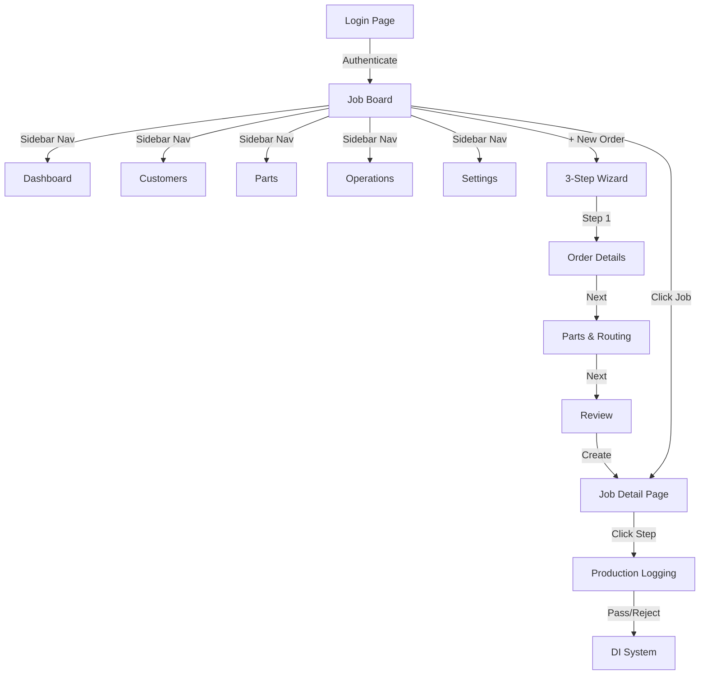

# MES Tracker — User Journey & Project Description

## Project Overview

**MES Tracker** is a **Manufacturing Execution System** built for shop-floor production tracking. It is designed for small-to-medium manufacturing companies (particularly precision engineering / grinding / machining shops) to manage job orders, track work-in-progress across multi-step routing workflows, and monitor quality through discrepancy/reject tracking.

### Tech Stack
| Layer | Technology |
|-------|-----------|
| Framework | Next.js 16 (App Router) |
| Language | TypeScript |
| Database | PostgreSQL (Docker) |
| ORM | Prisma |
| Auth | Session-based (bcrypt + cookies) |
| UI | Tailwind CSS + Lucide icons |
| Deployment | Vercel (production) / localhost (dev) |

### Core Entities
| Entity | Purpose |
|--------|---------|
| **User** | Admin/operator login accounts |
| **Customer** | Companies placing manufacturing orders |
| **Part** | Catalog of manufactured parts (e.g., bearings, shafts, flanges) |
| **Operation** | Manufacturing operations (e.g., Turning, Grinding, Inspection) |
| **Job (Order)** | A customer order containing parts with routing workflows |
| **Job Part** | A specific part within a job with quantity tracking |
| **Routing Step** | A single operation step in a part's manufacturing workflow |
| **Discrepancy Issue** | Quality issues / rejects logged during production |

---

## User Journey

### 1. 🔐 Login

The app starts at a clean login screen with the **MES — Production Tracker** branding. Users authenticate with email and password (session-based auth using bcrypt-hashed passwords and HTTP-only cookies).

- **Default credentials**: `admin@mes.local` / `admin123`
- After login, users are redirected to the **Job Board**

---

### 2. 📋 Job Board (Home Page)

The Job Board is the primary landing page — the operational nerve center.

**Layout:**
- **Left sidebar**: Persistent navigation with links to Job Board, Dashboard, Customers, Parts, Operations, and Settings. Shows logged-in user (Admin) at the bottom with sign-out.
- **Tab bar**: Toggle between "Active orders" and "History" (completed/cancelled)
- **Status summary cards**: Three cards showing counts for Active, Due Soon, and Overdue jobs
- **Job cards**: Each job shows:
  - Job number (e.g., `JOB-2026-9697874`)
  - Customer name
  - Current active operation (e.g., "CNC Machining")
  - Priority pill (NORMAL / HIGH / URGENT)
  - Delay status with color coding (Overdue = red, On track = green)
  - Progress bar showing step completion
  - Step count and PO number
- **"+ New order" FAB**: Floating action button at bottom-right

---

### 3. ⚙️ Operations Management

Navigate via the sidebar to **Operations**. This page lists all manufacturing operations available in the system.

**Layout:**
- **Counter header**: Shows total count (e.g., "8 OPERATIONS")
- **Operations list**: Each operation shows:
  - Wrench icon in an amber circle
  - Operation name (e.g., "OD Grinding")
  - Code + description (e.g., "ODG · External diameter grinding")
  - Usage count (e.g., "2 steps" = used in 2 routing steps)
- **Add form at bottom**: Inline form with fields for Name, Code, Description and an "Add operation" button

**What we created:**
> **Polishing** (Code: `POL`) — *High-precision surface polishing*

---

### 4. 📦 Parts Management

Navigate to **Parts** to manage the catalog of manufactured parts.

**Layout:**
- **Counter header**: Shows total (e.g., "6 PARTS")
- **Parts list**: Each part shows:
  - Package icon in a purple circle
  - Part name (e.g., "Aerospace shaft")
  - Part code (e.g., "P-AES")
  - Usage count (e.g., "1 uses" = attached to 1 job)
- **Add form at bottom**: Name (required), Part code, Description

**What we created:**
> **Precision Roller Bearing** (Code: `P-PRB`) — *High-load roller bearing assembly*

---

### 5. 👥 Customers Management

Navigate to **Customers** to manage the customer database.

**Layout:**
- **Counter header**: Shows total (e.g., "4 CUSTOMERS")
- **Customer list**: Each customer shows:
  - Users icon in a blue circle
  - Customer name (e.g., "Ingersoll Rand Ltd.")
  - Code + phone (e.g., "IR · +91 98765 43210")
  - Job count (e.g., "1 jobs")
- **Add form at bottom**: Name (required), Code, Phone, Email

**What we created:**
> **Tata Steel Industries** (Code: `TSI`, Phone: `+91 99887 76655`, Email: `procurement@tatasteel.com`)

---

### 6. 🆕 New Order — 3-Step Wizard

This is the core workflow. Click **"+ New order"** from the Job Board to launch the wizard.

#### Step 1 of 3 — Order Details

**Fields:**
- **Customer** (required): Dropdown with all registered customers
- **PO Number**: Purchase order reference
- **Due Date**: Date picker for delivery deadline
- **Priority**: Pill selector — NORMAL / HIGH / URGENT / LOW (color-coded)
- **Notes**: Free-text for special instructions

**Progress indicator**: Step progress shown as colored bars at the top (green = completed, blue = current, gray = pending)

**What we entered:**
> Customer: *Tata Steel Industries* | PO: *PO-TSI-2026-01* | Due: *25 Jun 2026* | Priority: *HIGH* | Notes: *Urgent delivery needed - critical production line*

---

#### Step 2 of 3 — Parts & Routing

This is the most sophisticated step, split into two sections:

**Section 1: Workflow Selection**

- All available operations shown as a 2-column grid
- **Tap to select in sequence** — each click adds a numbered badge (❶ Turning → ❷ OD Grinding → ❸ Polishing → ❹ Inspection)
- Selected operations highlighted in blue
- **Workflow chain** shown below: `Turning → OD Grinding → Polishing → Inspection`
- Tap again to deselect

**Section 2: Parts & Quantities**

- **Select part** from dropdown, enter **quantity**, optional drawing number
- Click **"+ Add part"** to add to the order
- Added parts shown as cards with routing chain and delete button
- Can add **multiple parts** to the same order, each with different quantities

**What we configured:**
> Part: *Precision Roller Bearing* | Qty: *100 pcs* | Routing: *Turning → OD Grinding → Polishing → Inspection*

---

#### Step 3 of 3 — Review

**Summary card** with all order details:
- Customer, PO, Due date, Priority, Part count
- Each part shown with its routing chain as pill badges
- **"✓ Create order"** button (green) to finalize
- **"← Back"** button to go back and edit

---

### 7. 📊 Job Detail Page

After order creation, the app redirects to the **Job Detail** page.

**Layout:**
- **Job header card**: Job number, customer, PO, due date, notes, and "On track" status badge
- **Action buttons**: Report & Delete (top-right)
- **Part section** for each part:
  - Part name + total quantity
  - **4-metric summary**: Done / Reject / Rework / Pending (color-coded cards)
  - **Routing step list**: Each step shows operation name, status, and quantity info
    - ▶ **Active** step (blue play icon): "Turning (active) — In: 100 · 100 remaining"
    - ○ **Pending** steps (gray): "OD Grinding — Pending", "Polishing — Pending", "Inspection — Pending"
  - Click any active step to enter **production logging** (pass/reject quantities)

---

### 8. 📋 Updated Job Board

Back on the Job Board, the new order appears in the list.

**Changes:**
- Active count: **1 → 2**
- New job card: `JOB-2026-3144234` | Tata Steel Industries | Turning | HIGH | On track | 0/4 steps · 1 part | PO-TSI-2026-01
- Existing overdue job still shown with red sidebar indicator

---

## Application Architecture

## Key User Flows

### Production Tracking Flow
1. Shop floor operator opens the **Job Board**
2. Clicks on an active job to see the routing steps
3. Clicks on the current **active step** (e.g., Turning)
4. Enters **pass quantity** (pieces that passed) and/or **reject quantity**
5. If rejects exist, a **Discrepancy Issue (DI)** is auto-created for review
6. When all pieces are passed, the step auto-completes and the **next step activates**
7. When all steps complete, the job status changes to **COMPLETED**

### Quality Management Flow
1. During production logging, rejected pieces trigger DI creation
2. DIs are categorized by reason (Crack, Dimensional, Surface defect, etc.)
3. DIs can be dispositioned: Rejected, Rework, Use-As-Is
4. Reworkable items can be sent back into the routing

---

## Browser Recordings

The following recordings capture the complete interaction flows:

| Recording | Description |
|-----------|-------------|
| `create_operation` | Navigating to Operations, filling in and submitting the form |
| `create_part` | Navigating to Parts, adding "Precision Roller Bearing" |
| `create_customer` | Navigating to Customers, adding "Tata Steel Industries" |
| `create_order_step1` | New order wizard — Step 1 (order details) |
| `create_order_step2` | New order wizard — Steps 2 & 3 (routing + review) |
| `submit_order` | Final submission and viewing the created job |
